这里网易易盾会在页面加载的时候传入主要js包这里包中有混淆初步判定是OB混淆。

这里给出请求图片的数据包所需要的**载荷**

可能是**固定**参数
```
{
  "referer": "https://dian2.ysbang.cn/#/login",
  "zoneId": "CN31",
  "https": "true",
  "type": "",
  "version": "2.28.5",
  "dpr": "1.5",
  "dev": "3",
  "ipv6": "false",
  "runEnv": "10",
  "group": "",
  "scene": "",
  "lang": "zh-CN",
  "sdkVersion": "",
  "loadVersion": "2.5.4",
  "iv": "4",
  "user": "",
  "width": "0",
  "audio": "false",
  "sizeType": "10",
  "smsVersion": "v3"
}
```
可能是**生成**参数
```
{
  "dt": "+fJNt80I1hFAU0BEVRKcBfECzwrz/vut(必须)",
  "irToken": "gFGudvHnaf5AdhRRAUbMRPFGpI+Ahyda(必须)",
  "id": "fdca1afff60e43c2846b1e9285bc7180(必须)",
  "fp": "8tBc5beDQZ/xqVsyIWw4trJieUog0z\\c0Q\\BZxZ/CYTm\\amNzLcqq2o9we\\0H4fLwZ37quYWc8GnyGSl2NOLiZPlEeE6ehiPqWt50eJHYNcaltXbOQIYE27hoLvRzSMo7t8J\\GyjEQix+Ov6WhCRjcI5R5litynvq+npygpdh1IY/V:1789957926868"(必须),
  "cb": "Y29cPchfgV1g5N9W/ZZLpmUsy3vRWfh50NBQ/UU2NRPDH8FJ1tshzi/pI4PbZsTee59YxIMs0En/yWYcnLke5miCbpX7(必须)",
  "token": "8a78f1e8fbb9462daffd83fbbf9f066a"(非必须),
  "callback": "__JSONP_unuie92_2(必须)"
}
```
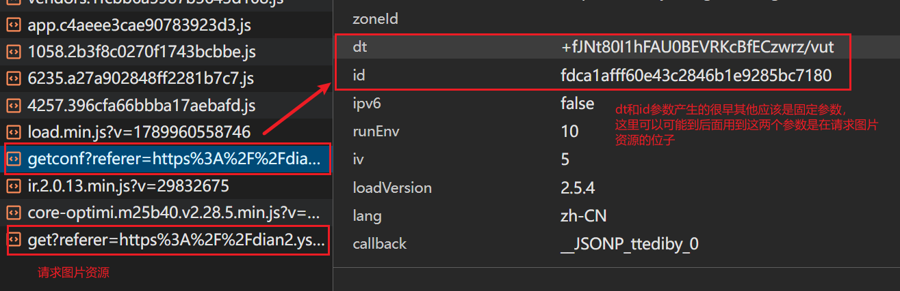
这里抓几次包可以对比dt和id是固定的还有一个"**callback**": "__JSONP_unuie92_2(必须)"这里随便拿一个值都行这里直接从一个请求拖一个下来用就行根据名字应该是方便服务器对应的就是一个标记位
```
dt=+fJNt80I1hFAU0BEVRKcBfECzwrz/vut
id=fdca1afff60e43c2846b1e9285bc7180
callback:__JSONP_k2k9s2p_0
```
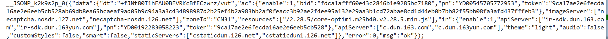
这几个值没问题了我们接着看现在不知道的参数就只剩下这三个
```
"irToken": "gFGudvHnaf5AdhRRAUbMRPFGpI+Ahyda(必须)",
"fp": "8tBc5beDQZ/xqVsyIWw4trJieUog0z\\c0Q\\BZxZ/CYTm\\amNzLcqq2o9we\\0H4fLwZ37quYWc8GnyGSl2NOLiZPlEeE6ehiPqWt50eJHYNcaltXbOQIYE27hoLvRzSMo7t8J\\GyjEQix+Ov6WhCRjcI5R5litynvq+npygpdh1IY/V:1789957926868"(必须),
"cb": "Y29cPchfgV1g5N9W/ZZLpmUsy3vRWfh50NBQ/UU2NRPDH8FJ1tshzi/pI4PbZsTee59YxIMs0En/yWYcnLke5miCbpX7(必须)",
```
这里测试了一会，发现一个有点意思的地方：这里真的发包不在单击获取验证码的瞬间，而是在验证码窗口被关闭的瞬间就会触发 close，然后得到下一个数据包。这个中间会触发一系列的 js 操作来得到上面三个参数
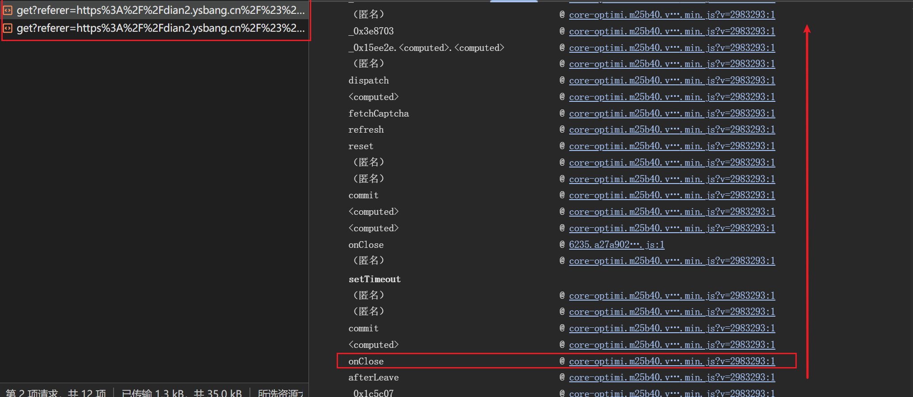
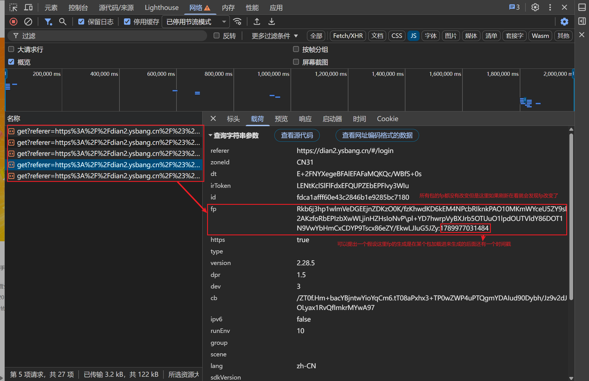
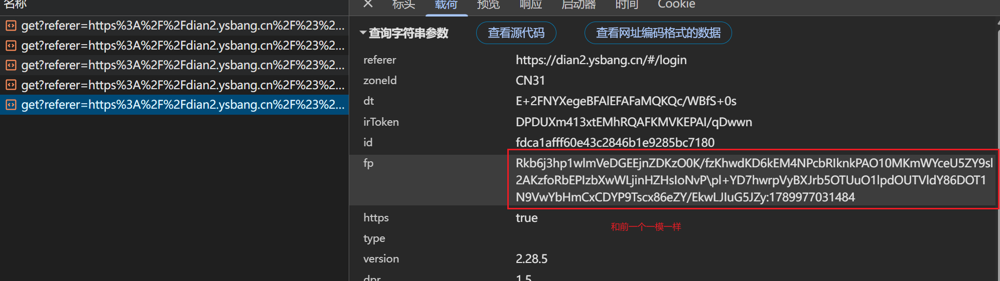
特别记一下这个文件 core-optimi.m25b40.v2.28.5.min.js?v=2983293，在这个文件中搜索 **fingerprint** 找到 fp 的赋值的位置
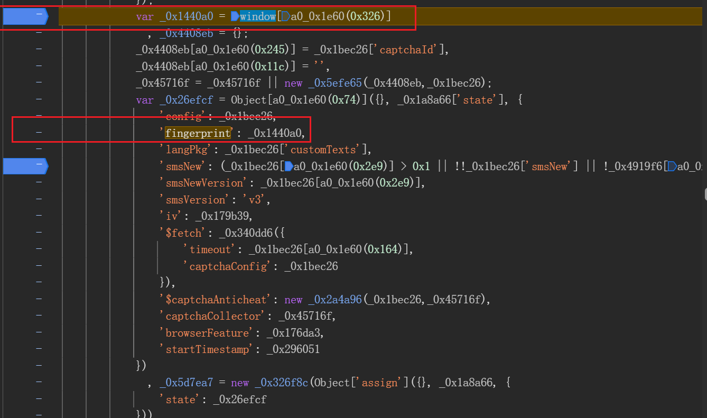
这里是直接拿了**window.gdxidpyhxde**
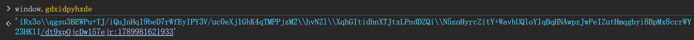
符合对fp的结构这里选择去hook一下看一下生成位置这里还是在core-optimi.m25b40.v2.28.5.min.js中生成的这里在core-optimi.m25b40.v2.28.5.min.js加载前断住window下并没有该参数
```
let _v;
  Object.defineProperty(window, 'gdxidpyhxde', {
    configurable: true,
    get() { console.log('[GET]', _v); console.trace(); return _v; },
    set(v) { console.log('[SET]', v); console.trace(); _v = v; },
  });
```
可以通过调用栈直接找到生成位置这里在这里
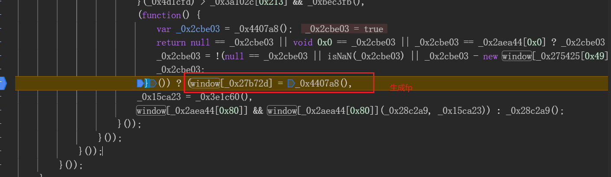
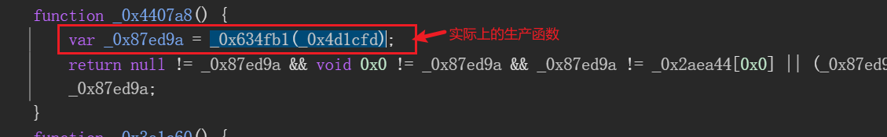
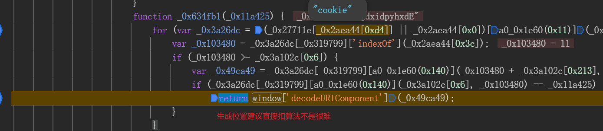
这里抠到后面会发现 cookie 中就有 fp，惊不惊喜意不意外，这里接着分析剩下的参数
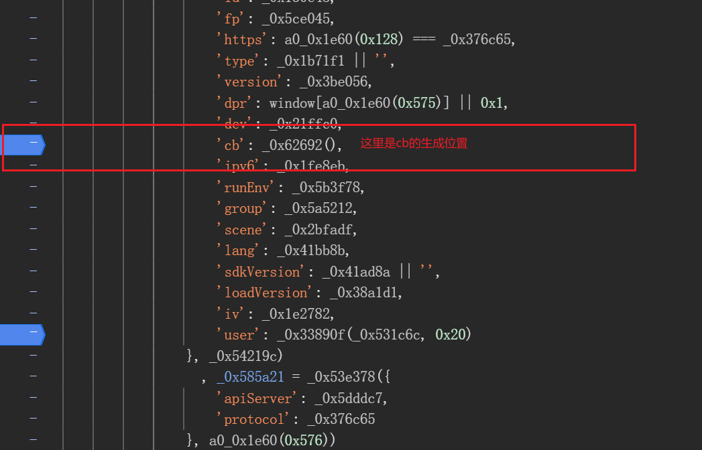
这里cb是明文直接向上查
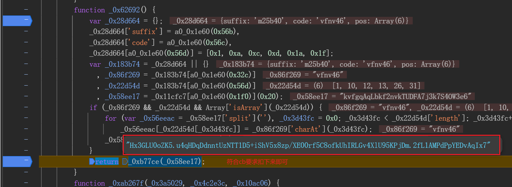
这里到irToken
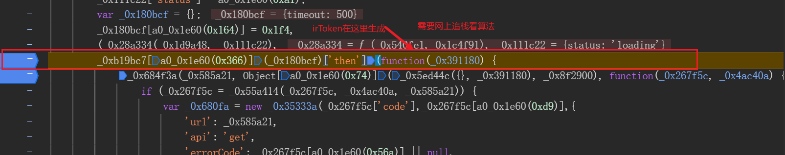
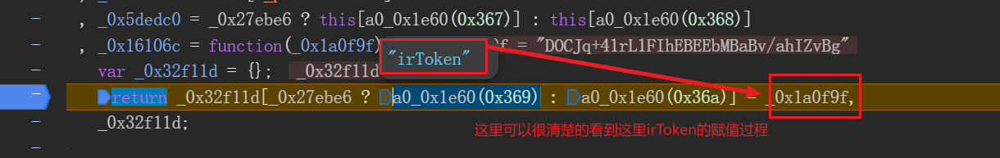
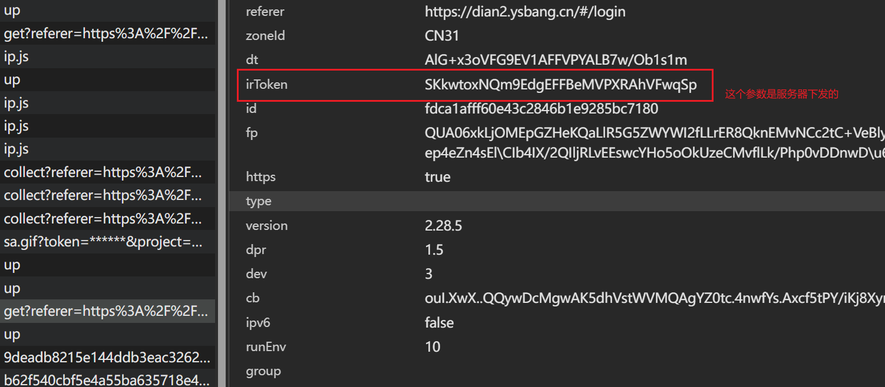
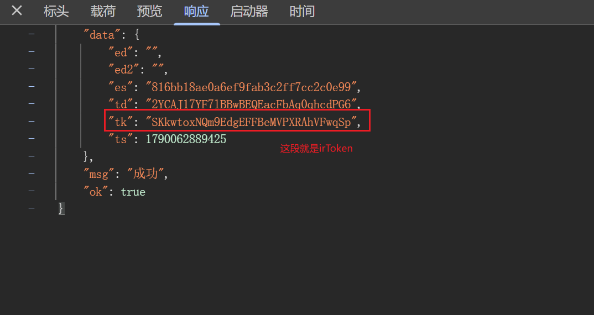
这个数据在up数据包中可以看到这里我们继续追
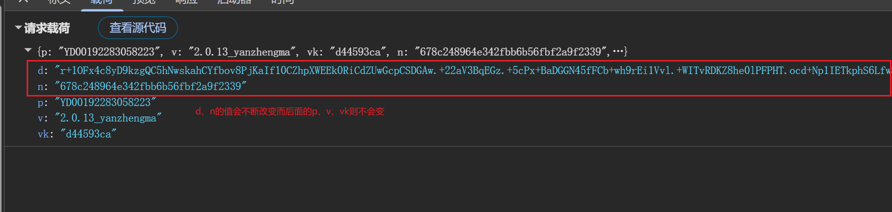
所以我们现在的目标是追到d和n发up包得到irToken
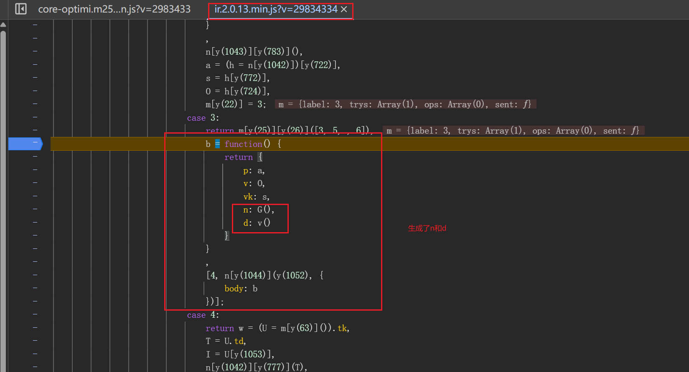
这个包是一个ob混淆的包这里直接丢给模型分析纯算d和n了这里是有一个环境监测的这里，纯算分析见分析报告
## 请求背景图片和缺口图片的分析到此为止，我们进入对最终请求包的分析
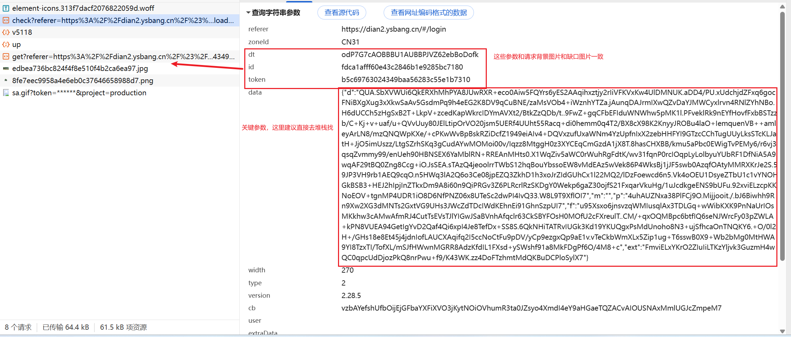
这个check就是对滑块的校验，这里可以看到data字段中有这几个值d、m、p、f、ext。不要去看第一次的包，这里看堆栈
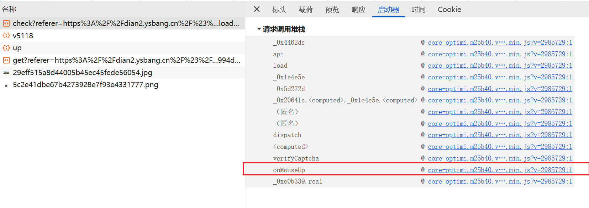
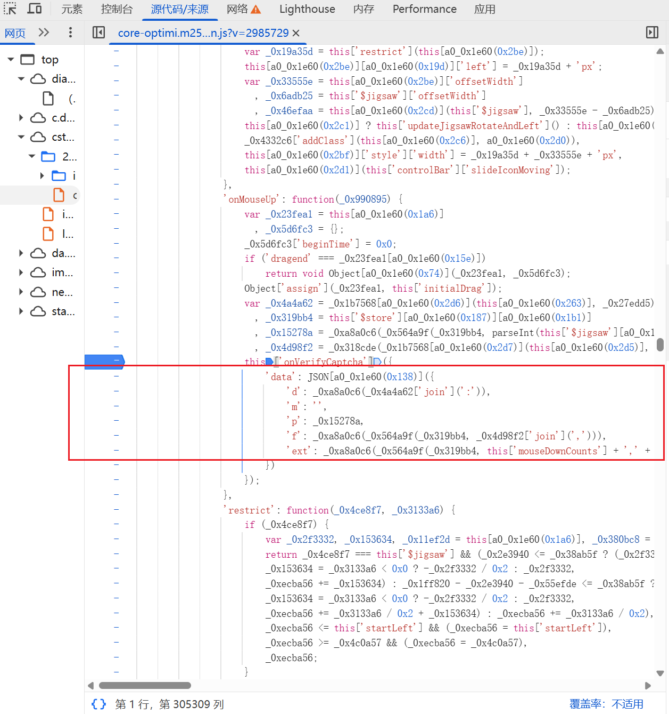
这里也可以通过 JSON 来找，当然这里有一个 OB 可能不太好定位，建议老老实实看堆栈。稍微注意一点：不要去看页面刷新后的第一次操作的包，里面可能有一些监听的挂载会很乱，这里分析第二次请求的数据包
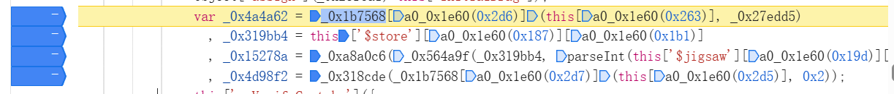
最关键的值的位置。data 一共 5 个字段（d、m、p、f、ext），其中 m 恒为空串，所以真正要看的是 d、p、f、ext 这四个。这里调试需要滑动滑块后抬起鼠标触发(onMouseUp)，我们依次看这几个值。_0x4a4a62 也就是 d 依赖的值，它的生成依赖于 sample 方法，取的是 this 的 traceData（里面存的是加密后的点）
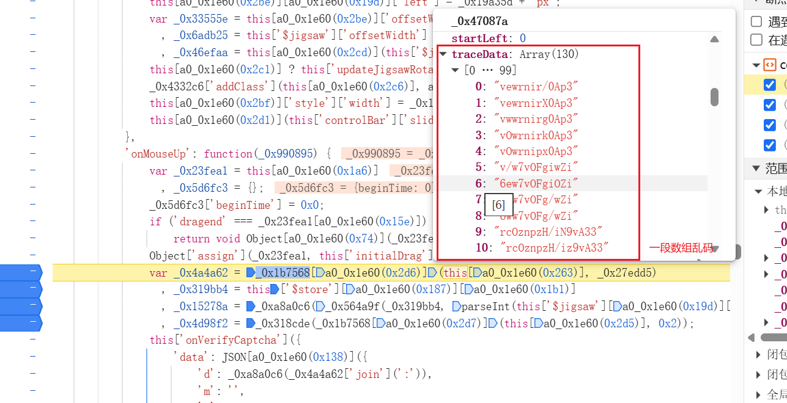
这里在当前作用域下找一下有没有 traceData 的 push 操作，看一下这个生成的位置。sample 则是个固定的方法，好补。我们搜索 a0_0x1e60(0x263)（就是 'traceData' 的混淆下标）这段 ob 混淆可以找到 push 的位置
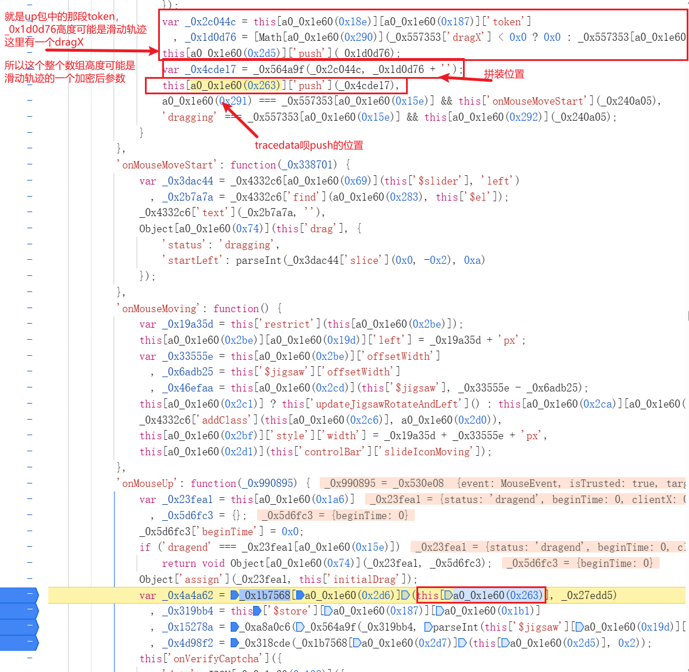
这里可以看到在进入加密后，this 还存了一份原始数据（atomTraceData）：滑块同时维护两个数组，traceData 存 xorEncode 后的密文点、atomTraceData 存原始点，我们可以调用看下
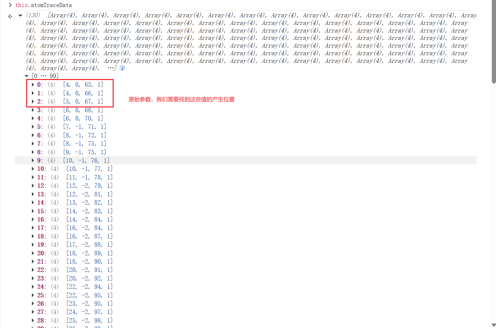
这里突然发现这个 token 和我们 up 的 token（irToken）并不相同，误判了，应该是获取背景和缺口图中夹带的 token（也就是 /get **响应**里新发的那个，不是 /get 请求里带进去的），这里不再深究了，然后是这句
```
[Math[a0_0x1e60(0x290)](_0x557353['dragX'] < 0x0 ? 0x0 : _0x557353[a0_0x1e60(0x26c)]), Math['round'](_0x557353['clientY'] - _0x557353[a0_0x1e60(0x28f)]), _0x1b7568[a0_0x1e60(0x259)]() - _0x557353['beginTime'], null == _0x240a05[a0_0x1e60(0x26)] ? 0x0 : _0x240a05[a0_0x1e60(0x26)] ? 0x1 : 0x2];
```
我们拆开看，第一部分
```
[Math[a0_0x1e60(0x290)](_0x557353['dragX'] < 0x0 ? 0x0 : _0x557353[a0_0x1e60(0x26c)])
_0x557353['dragX']滑块的x方向滑动距离，a0_0x1e60(0x290)为round这里就很明显了，对x滑动距离进行处理避免<0
```
第二部分
```
Math['round'](_0x557353['clientY'] - _0x557353[a0_0x1e60(0x28f)])
拿clientY-startY存y的滑动时上下偏移量
```
第三部分
```
_0x1b7568[a0_0x1e60(0x259)]() - _0x557353['beginTime']
Date.now()-开始时间（a0_0x1e60(0x259) 是 'now'，不是 getTime）
```
第四部分
```
null == _0x240a05[a0_0x1e60(0x26)] ? 0x0 : _0x240a05[a0_0x1e60(0x26)] ? 0x1 : 0x2]
isTrusted。这里是三分支：null→0、true→1、false→2。真实的鼠标事件 isTrusted 恒为 true，所以这一位恒为 1
```
这里可以得到数组的结构就很明朗了：0:x 的距离，1:y 的滑动偏移，2:滑动时间，3:isTrusted 标志位（恒为 1）。这里模拟脚本不赘述了
加密函数这里很好扣，不赘述，建议单独一个文件存加密函数可以复用
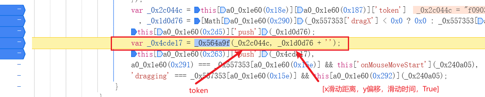
这里看sample函数
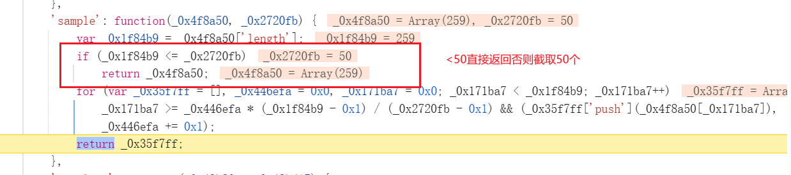
很简单的一个截取操作，看下一个操作_0x319bb4熟悉的配方
```
_0x319bb4 = this['$store'][a0_0x1e60(0x187)][a0_0x1e60(0x1b1)]
```
拿 this 的 token，也就是 https://c.dun.163.com/api/v3/get 拿回来的 token（注意是 /get **响应**里新发的那个，不是 /get 请求里带进去的）
然后是_0x15278a
```
_0x15278a = _0xa8a0c6(_0x564a9f(_0x319bb4, parseInt(this['$jigsaw'][a0_0x1e60(0x19d)]['left'], 0xa) / this[a0_0x1e60(0x154)] * 0x64 + ''))
```
这里_0x319bb4是token，parseInt(this['$jigsaw'][a0_0x1e60(0x19d)]['left'], 0xa)拿的是图片滑动的px距离然后parseInt一下得到数字后/图片宽度(缩略过的)*100，_0x564a9f和_0xa8a0c6不再赘述，补一下即可，到_0x4d98f2
```
_0x4d98f2 = _0x318cde(_0x1b7568[a0_0x1e60(0x2d7)](this[a0_0x1e60(0x2d5)], 0x2));
```
对原始的滑动轨迹进行处理。a0_0x1e60(0x2d5) 是 'atomTraceData'，就是上面那份原始点（d 用的是加密后的 traceData，f 用的才是这份）。先是 unique2DArray 然后是 _0x318cde，现在可以进入最后的阶段生成 data
```
'data': JSON[a0_0x1e60(0x138)]({
      'd': _0xa8a0c6(_0x4a4a62['join'](':')),
      'm': '',
      'p': _0x15278a,
      'f': _0xa8a0c6(_0x564a9f(_0x319bb4, _0x4d98f2['join'](','))),
      'ext': _0xa8a0c6(_0x564a9f(_0x319bb4, this['mouseDownCounts'] + ',' + this['traceData']['length']))
})
```
_0xa8a0c6加密函数得扣
this['mouseDownCounts']为1
这里附上请求成功结果
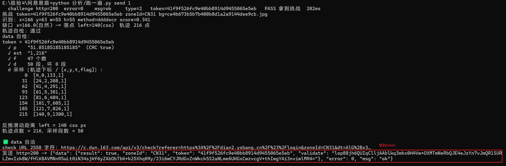